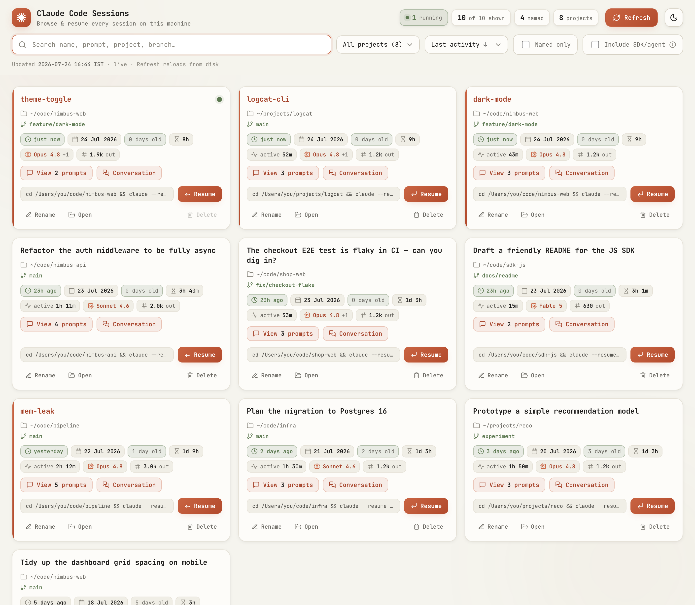
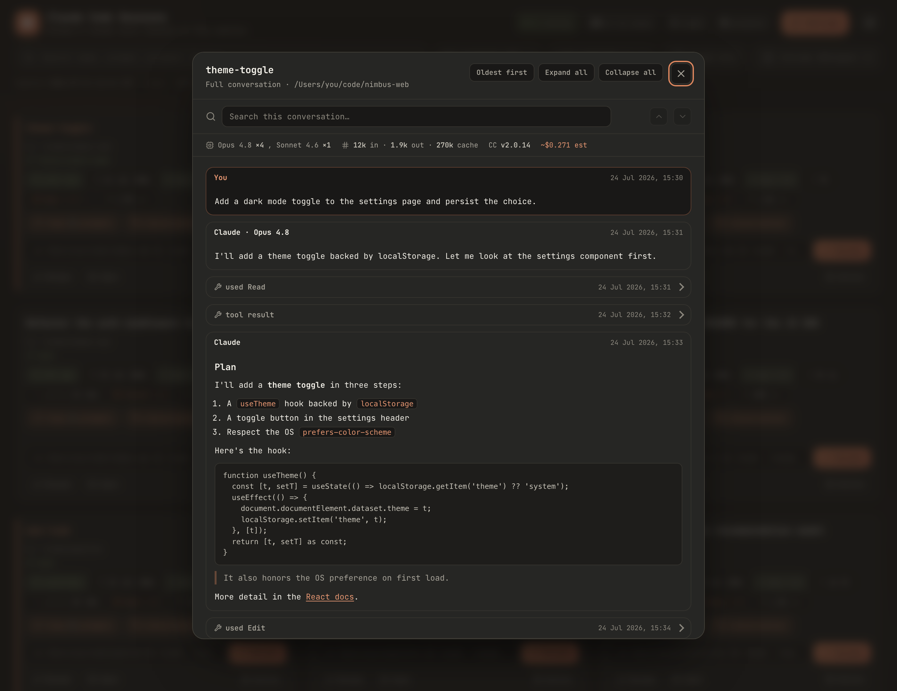

<div align="center">

# Claude Code Sessions

**A live, local dashboard to browse, search, resume, and manage every [Claude Code](https://claude.com/claude-code) session on your machine.**

No more digging through `~/.claude/projects` or guessing session names — one click to refresh, rename, delete, open, or copy a resume command.

<picture>
  <source media="(prefers-color-scheme: dark)" srcset="docs/screenshot-dark.png">
  
</picture>

</div>

## Why

Claude Code stores each session as a `.jsonl` file under `~/.claude/projects/…`. Over time you accumulate hundreds, and resuming the right one means remembering exact names and directories (`claude --resume "name"` fails with *"no session named X"* if you're in the wrong folder). This turns that pile into a fast, searchable dashboard — served locally, in your browser.

## Features

**Find**
- 🔎 **Search** across names, prompts, project paths, branches, and session ids
- 🗂️ **Filter & sort** — by project, and by last activity / oldest / duration / most prompts / named / project
- ☑️ **Named-only** and **Include SDK/agent** toggles (the latter reveals programmatic/subagent sessions, hidden by default)

**Live status**
- 🟢 **Running indicator** — a pulsing dot on sessions an agent is *actively* writing to right now (polled every few seconds)
- ⬆️ Running sessions **sort to the top**, with a **"N running"** counter in the header
- 🔁 **One-click Refresh** — rescans your sessions from disk instantly

**Per-session insight** *(each card)*
- 🧠 **Model chip** — the model(s) used, e.g. `Opus 4.8 +1`; hover for the per-model turn breakdown
- 🔢 **Output-tokens chip** — tokens generated; hover for input / output / cache
- 🕐 Relative + absolute **last activity**, age, **session duration**, and **active working time**
- 📁 Project path shown from home as `~/…` (full absolute path on hover) with the **git branch** below
- 🔖 **Named** sessions show their name as the card title in the Claude accent colour

**Manage** *(no terminal round-trip)*
- ✏️ **Rename** inline (writes a `custom-title` row to the session file)
- 🗑️ **Delete** with a confirm step — automatically **blocked for running sessions**
- 📂 **Open** the project folder in your file manager
- 📋 **Resume** — copies `cd /path && claude --resume "name"`, ready to paste

**Read**
- 📝 **Prompts** — every prompt you sent, including pasted images, collapsible with copy-per-prompt
- 💬 **Full conversation transcript** — your prompts + Claude's replies **rendered as Markdown** (headings, lists, code blocks, links), with tool calls & results as collapsible rows, and the **model labelled per turn** (only when it changes)
- 🔦 **Search inside a conversation** — `⌘/Ctrl-F` to highlight matches with `n/total` count and up/down navigation
- ↕️ **Oldest ↔ Newest** order toggle in both viewers
- 📊 **Stats strip** — models × turn counts · input/output/cache tokens · web-search/fetch counts · Claude Code version · optional **cost estimate**

**Look & feel**
- 🌙 **Dark by default**, with a light/dark toggle (your choice is remembered)
- ⌨️ Clean monospace UI in the Claude palette; themed tooltips; respects `prefers-reduced-motion`

**Private & self-contained**
- 🔒 Pure **Python standard library** — no `pip install`, no dependencies, no network
- Binds to `127.0.0.1` only, rejects non-loopback hosts, and requires JSON `POST` bodies (so a random web page can't reach it)

<div align="center">
  
</div>

## Requirements

- **Python 3.7+** — standard library only
- macOS, Linux, or Windows
- Some Claude Code sessions in `~/.claude/projects` (nothing to configure — it uses *your* home dir)

## Install

```bash
# grab the script and make it executable
curl -fsSL https://raw.githubusercontent.com/wannabemrrobot/claude-sessions/main/claude-sessions -o claude-sessions
chmod +x claude-sessions

# put it on your PATH
mv claude-sessions /usr/local/bin/      # or ~/bin, ~/.local/bin, …
```

…or clone:

```bash
git clone https://github.com/wannabemrrobot/claude-sessions.git
cd claude-sessions && chmod +x claude-sessions
./claude-sessions
```

## Usage

```bash
claude-sessions                 # launch the live dashboard (opens your browser)
claude-sessions --all           # also include SDK/agent-spawned sessions
claude-sessions --port 7842     # choose a preferred port
claude-sessions --root PATH     # use a non-standard projects dir
claude-sessions --no-open       # serve without opening the browser
claude-sessions --static        # write a portable, self-contained .html instead
claude-sessions --json          # dump session metadata as JSON
claude-sessions --rename ID_OR_NAME "New name"
claude-sessions --delete ID_OR_NAME [ID_OR_NAME …]
```

The live dashboard runs until you press `Ctrl+C`.

### Two modes

| Mode | Command | Refresh / Rename / Delete / Conversation | Portable |
|------|---------|------------------------------------------|----------|
| **Live** _(default)_ | `claude-sessions` | ✅ one-click | needs the process running |
| **Static** | `claude-sessions --static` | read-only (prompts only) | ✅ single self-contained `.html` |

### Shortcuts & deep-links

- **`⌘/Ctrl-F`** — search inside an open conversation · **`Enter` / `Shift+Enter`** — next / previous match · **`Esc`** — clear search, then close
- Append to the URL: `?theme=light|dark` · `?conversation=<id>` (optionally `&find=<text>`) · `?prompts=<id>` · `?order=oldest|newest`

## Configuration

Everything works out of the box. A couple of knobs live at the top of the script:

- **Cost estimate** — `SHOW_COST` (on/off) and `PRICING` (USD per 1M tokens, by model family). The shipped rates are **examples — verify and edit them**; models without a rate are excluded and the figure is marked *"(partial)"*. The estimate is **not meaningful on a Max/Pro subscription** (usage isn't billed per token), so treat it as a rough API-rates approximation only.
- **`ACTIVE_WINDOW_S`** — how recently a session's file must have changed to count as "running" (default 60s).

## How it works

It scans `~/.claude/projects/<encoded-cwd>/<uuid>.jsonl`, extracts each session's title, project, branch, timestamps, duration, prompts, and model/token usage, and serves a dashboard from a tiny `http.server` bound to `127.0.0.1`. Conversations are parsed on demand (so the list stays fast). **Nothing leaves your machine.** Rename appends a `custom-title` row to the session file; delete removes the file.

## Privacy & safety

Everything is local. The server listens only on `127.0.0.1`, makes zero outbound requests, guards against non-loopback hosts and path traversal, and the `--static` export embeds only the metadata you already see. It's a single, readable Python file — audit it in a minute.

## Credits

Icons from [Lucide](https://lucide.dev) (ISC). Built with [Claude Code](https://claude.com/claude-code).

## License

[MIT](LICENSE) © wannabemrrobot
